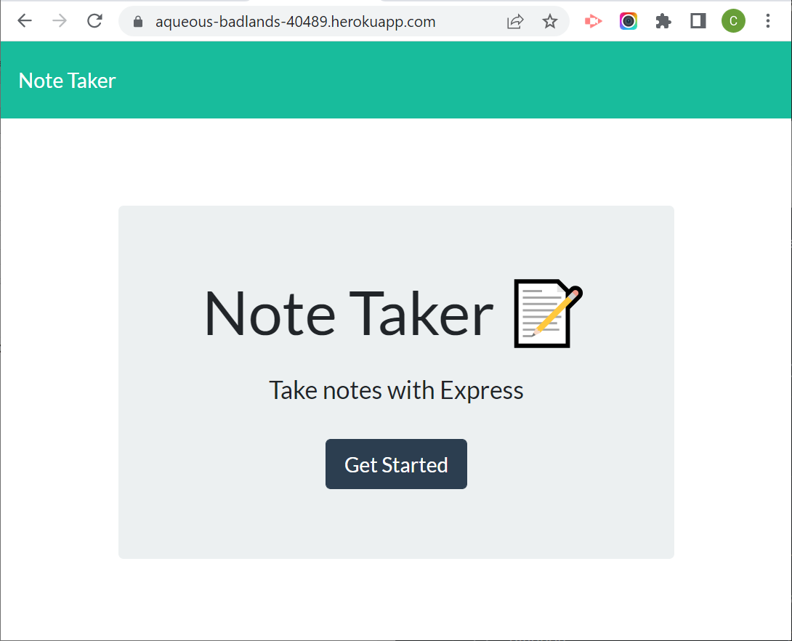
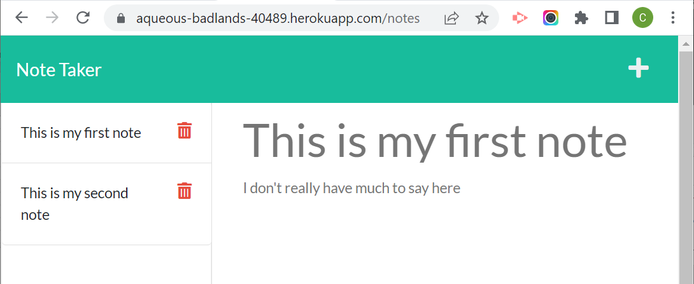

# 11 Express.js Challenge: Note Taker

## Table of Contents
- [Description](#description)
- [Visuals](#visuals)
- [Usage](#usage)

## Description
This is the solution JavaScript for the 02-Challenge assignment in the 11 Express.js Module.

The purpose of the assignment was to create an Express.js service that serves starter code for a persistent note taking application.  The routes for *index.html* and */notes* are handled, serving HTML from the *public* directory.  The routes for /api/notes/ (GET and POST) and /api/notes/:id (DELETE) are handled with code that serves up a JSON array from */db/db.json*.  The POST method adds to the JSON file, while DELETE permanently removes the selected element from the JSON file.  The DELETE was implemented for the *10 points of extra credit*.

Small changes were made to the index.js servicing the notes.html page to make the display refresh when notes were added or deleted.

## Usage 
This program has been deployed to Heroku here https://aqueous-badlands-40489.herokuapp.com/ .  Alternatively, this program can be invoked via node at the command prompt using *npm start* or *nodemon*.

## Installation Instructions
The program requires *npm* installation of the express, path, and fs modules (and their dependencies).  

## Visuals
### The site in operation

